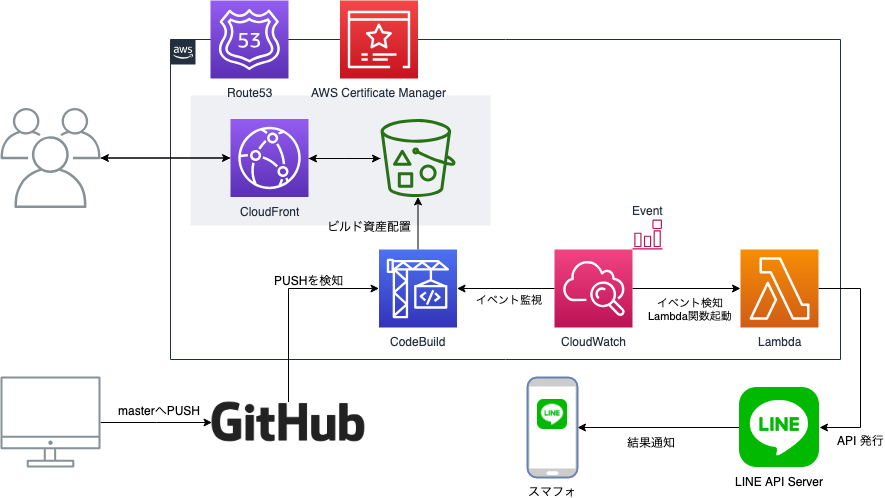

# What's this...

VuePressを使用したミニブログです。  

* [チラ裏のメモ帳 - https://cheatsheet.kitigai.org/](https://cheatsheet.kitigai.org/)

## コンセプト

ローカルに雑に累積しているメモを何らかのタイミングで整備して自身で参照しやすくするための場が欲しかったので作成しました。  
自分のためのチートシートになるようアップデートしていく予定です。

また、自身のはてなブログとの棲み分けなどは今後考えていければ良いかなとは思いますが  
基本的にローカルに累積しているメモを定期的に整理していくので見ればわかるようなコマンドなどを記載しようかと考えています。

## 開発環境

* Mac OS X Mojave 10.14.3
* VisualStudio Code 1.32.2

```sh
$ node -v
v11.12.0
$ npm -v
6.7.0
$ vuepress -V
0.14.10
```

## インフラ構成

基盤はAWSを使用しています。

CloudFront + S3の基本構成でAWS CodeBuildによる自動ビルド・デプロイ環境を整備済みです。  
DNSはAWS Route53を使用しSSL証明書はACMを使用しています。



# 関連ブログ記事
このプロジェクトに関連するブログ記事です。

* [VuePressを起動するとres\.getHeader is not a functionエラーが発生する。 \- あとらすの備忘録](https://kitigai.hatenablog.com/entry/2019/03/23/040448)
* [VuePressのLastUpdated表示フォーマットを変更する。 \- あとらすの備忘録](https://kitigai.hatenablog.com/entry/2019/03/24/033818)
* [VuePressに GoogleSearchConsole のメタタグを埋め込む \- あとらすの備忘録](https://kitigai.hatenablog.com/entry/2019/03/28/233451)
* [Algolia DocSearch\-Scraperでクロールを実行する（INDEXを作成する） \- あとらすの備忘録](https://kitigai.hatenablog.com/entry/2019/04/03/155921)
* [VuePressでAlgolia DocSearchを有効化する（申請パターン） \- あとらすの備忘録](https://kitigai.hatenablog.com/entry/2019/04/04/133432)

# 関連プロジェクト
本プロジェクトは下記のプロジェクトと関連しています。

* 
* 
* 